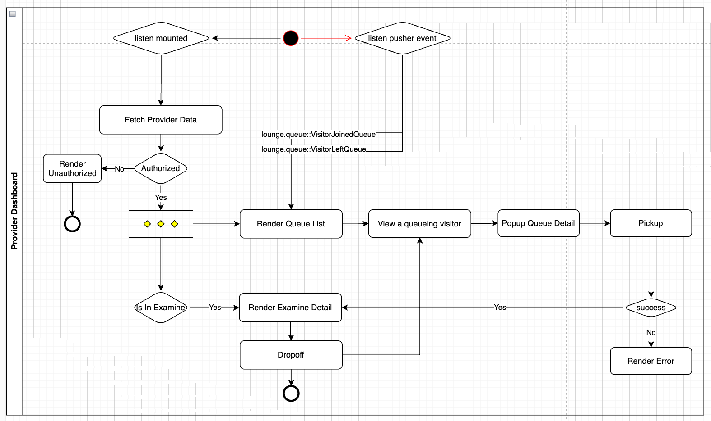
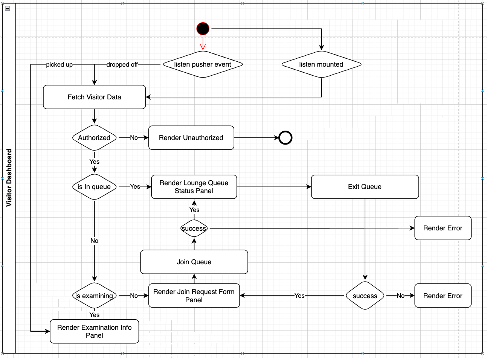

# VSee Challenge - Clinic Room

A real-time virtual clinic room application built with React, TypeScript, and Vite. The application enables seamless interaction between healthcare providers and visitors in a virtual waiting room environment.

## Overview

This application simulates a virtual clinic environment where:
- Visitors can join a queue and wait for their turn
- Providers can manage their queue and interact with visitors
- Real-time updates for queue status and examinations
- Secure video consultations between providers and visitors

## Technology Stack

- **Frontend Framework**: React 18 with TypeScript
- **Build Tool**: Vite
- **Styling**: Tailwind CSS
- **State Management**: React Context + Hooks
- **Real-time Communication**: Pusher
- **HTTP Client**: Axios
- **Routing**: React Router v6
- **Type Checking**: TypeScript
- **Package Manager**: npm

## Prerequisites

- Node.js (v18.x)
- npm (latest version)

## Getting Started

1. **Clone the repository**
```bash
git clone <repository-url>
cd vsee-fe
```

2. **Install dependencies**
```bash
npm install
```

3. **Configure environment variables**
Create a `.env` file in the root directory:
```env
VITE_API_BASE_URL=http://localhost:8000/api
VITE_PUSHER_APP_KEY=your-pusher-key
VITE_PUSHER_APP_CLUSTER=your-pusher-cluster
VITE_PUSHER_APP_HOST=localhost
VITE_PUSHER_APP_PORT=6001
VITE_PUSHER_APP_SCHEME=http
```

4. **Start development server**
```bash
npm run dev
```

## Project Structure

```
src/
├── components/          # Reusable UI components
│   ├── common/         # Shared components
│   ├── provider/       # Provider-specific components
│   └── visitor/        # Visitor-specific components
├── contexts/           # React Context providers
├── hooks/              # Custom React hooks
├── pages/              # Page components
├── services/           # API and external services
├── styles/             # Global styles and Tailwind config
├── types/              # TypeScript type definitions
└── utils/              # Utility functions
```

## Actor Flows

### Provider Dashboard Flow


The Provider Dashboard enables healthcare providers to:
- View and manage their waiting room queue
- Pick up visitors for examination
- View examination details
- Drop off visitors after consultation
- Handle real-time updates for queue changes

### Visitor Dashboard Flow


The Visitor Dashboard allows patients to:
- Join the virtual waiting room
- View their position in queue
- Monitor estimated wait times
- Participate in video consultations
- Exit queue or examination as needed

## Real-time Features

The application uses Pusher for real-time communication:
- Queue status updates
- Examination status changes
- Provider-visitor interactions
- Video call signaling

## Development Guidelines

- Use TypeScript for all new code
- Follow the existing component structure
- Implement error handling for all async operations
- Add appropriate loading states
- Maintain real-time sync with Pusher events

## Contributing

1. Create a feature branch
2. Make your changes
3. Submit a pull request

## License

This project is private and confidential. All rights reserved.

## Support

For any questions or issues, please contact the development team:

**Developer**: Dang Hoang Thien  
**Email**: danghoangthien@gmail.com
